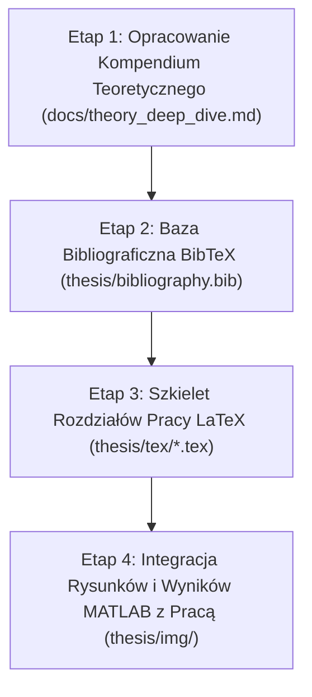

# Plan Nauki Teorii i Przygotowania Rozdziałów Pracy Dyplomowej

Kompleksowy plan usystematyzowania wiedzy teoretycznej, przygotowania materiałów dydaktyczno-naukowych, skonfigurowania bazy bibliograficznej BibTeX oraz przygotowania szkieletu rozdziałów w systemie $\LaTeX$ dla pracy inżynierskiej / magisterskiej pt. *„Pasywny radar Wi-Fi oparty na sygnałach OFDM (IEEE 802.11a)”*.

---

## 🎯 Cele Główne
1. **Opanowanie aparatu matematycznego i teoretycznego**: Pełne zrozumienie modelu kanału wielodrożnego, estymacji transmitancji Zero-Forcing, filtracji MTI, 2D Periodogramu Range-Doppler oraz algorytmu Coherent CLEAN.
2. **Stworzenie kompendium teoretycznego w projekcie**: Przygotowanie szczegółowego opracowania matematyczno-algorytmicznego z wyprowadzeniami gotowymi do wykorzystania w pracy.
3. **Zbudowanie kompletnej bibliografii (`bibliography.bib`)**: Wprowadzenie ustrukturyzowanych rekordów BibTeX dla kluczowych prac naukowych (Martin Braun, standardy IEEE, literatura DSP prof. T. Zielińskiego, artykuły przeglądowe z `references/`).
4. **Rozbudowa i strukturyzacja szablonu pracy $\LaTeX$ (`thesis/`)**: Utworzenie modularnych plików rozdziałów z gotowymi szkicami sekcji teoretycznych, wzorami i odnośnikami do kodu symulacyjnego.

---

## 👥 Weryfikacja i Decyzje Użytkownika

> [!IMPORTANT]
> Prosimy o potwierdzenie szczegółów formalnych pracy (tytuł, kierunek, stopień studiów), aby właściwie skonfigurować metadane w plikach $\LaTeX$:
> - **Tytuł pracy**: np. *„Badanie algorytmów estymacji parametrów obiektów ruchomych w pasywnym radarze Wi-Fi OFDM”* (lub wersja uzgodniona z promotorem prof. T. Zielińskim).
> - **Stopień studiów**: Inżynierska / Magisterska.
> - **Kierunek i Wydział**: WFiIS AGH / Informatyka Stosowana / Teleinformatyka.

---

## 📋 Proponowane Etapy Realizacji

---

### Etap 1: Kompendium Teoretyczne i Notatki Naukowe (`docs/`)

Utworzenie wyczerpującego dokumentu referencyjnego zawierającego pełne wyprowadzenia matematyczne, tabele parametrów oraz analizę porównawczą metod.

#### [NEW] [`docs/theory_deep_dive.md`](file:///c:/Users/tymwo/Projects/MATLAB/WiFi%20Radar/docs/theory_deep_dive.md)
- **Rozdział 1: Fizyka i Geometria Radaru Pasywnego (PBR)**
  - Geometria bistatyczna, linia bazowa, bistatyczny RCS i zasięg jednoznaczny.
  - Zależności dyspersyjne, bilans łączy i wpływ SNR.
- **Rozdział 2: Warstwa Fizyczna IEEE 802.11a**
  - Siatka podnośnych FFT ($N_{fft}=64$, $N_{cp}=16$, 52 aktywne podnośne).
  - Preambuła PLCP (L-STF, L-LTF) i synchronizacja Schmidla-Coxa ($M(d) = \frac{|P(d)|^2}{R^2(d)}$).
- **Rozdział 3: Przetwarzanie Sygnałów OFDM wg Brauna**
  - Model macierzowy czas-częstotliwość ($Y = H \cdot X + W$).
  - Porównanie: *Time-Domain Cross-Ambiguity Function (CAF)* vs *Frequency-Domain Division (Zero-Forcing)*.
  - Wyprowadzenie 2D Periodogramu Range-Doppler ($\text{IFFT}_f \to \text{Range}$, $\text{FFT}_t \to \text{Doppler}$).
- **Rozdział 4: Tłumienie Zakłóceń i Przetwarzanie Koherentne**
  - Tłumienie przesłuchu bezpośredniego (filtr MTI w czasie wolnym).
  - Liniowa naprawa luki podnośnej stałoprądowej DC (indeks 33).
  - Okienkowanie 2D Blackman-Harris (92 dB tłumienia listków bocznych).
  - Algorytm Coherent Successive Target Cancellation (CLEAN) – model odpowiedzi impulsowej i dekonwolucja koherentna.
- **Rozdział 5: Trendy Współczesne (ISAC & Wi-Fi Sensing)**
  - Ewolucja od PBR do ISAC, CSI sensing na kartach komercyjnych, standard IEEE 802.11bf.

---

### Etap 2: Baza Bibliograficzna BibTeX (`thesis/bibliography.bib`)

Uzupełnienie pliku bibliografii o kompletną, zrecenzowaną literaturę naukową wykorzystaną w projekcie.

#### [MODIFY] [`thesis/bibliography.bib`](file:///c:/Users/tymwo/Projects/MATLAB/WiFi%20Radar/thesis/bibliography.bib)
- Dodanie pełnych rekordów:
  - **Rozprawa doktorska Martina Brauna** (KIT, 2014) – fundament algorytmiczny.
  - **Specyfikacja standardu IEEE 802.11a / IEEE 802.11-2012 / IEEE 802.11bf**.
  - **Praca klasyczna Schmidla i Coxa** (IEEE Trans. Commun., 1997) – synchronizacja OFDM.
  - **Publikacje prof. Tomasza Zielińskiego** dotyczące cyfrowego przetwarzania sygnałów i telekomunikacji.
  - **Artykuły przeglądowe dotyczące Wi-Fi Sensing i ISAC** (IEEE Surveys & Tutorials, ACM MobiSys Widar 3.0, Sensors).

---

### Etap 3: Modułowa Struktura Rozdziałów Pracy w $\LaTeX$ (`thesis/tex/`)

Przygotowanie właściwej struktury rozdziałów pracy zgodnie ze standardami akademickimi AGH.

#### [MODIFY] [`thesis/main.tex`](file:///c:/Users/tymwo/Projects/MATLAB/WiFi%20Radar/thesis/main.tex)
- Ustawienie poprawnej konfiguracji `\include` dla wszystkich rozdziałów.

#### [MODIFY] [`thesis/tex/01_titlePage.tex`](file:///c:/Users/tymwo/Projects/MATLAB/WiFi%20Radar/thesis/tex/01_titlePage.tex) & [`thesis/tex/03_MasterThesisOutline.tex`](file:///c:/Users/tymwo/Projects/MATLAB/WiFi%20Radar/thesis/tex/03_MasterThesisOutline.tex)
- Wypełnienie pól organizacyjnych, opiekuna (prof. Tomasz Zieliński) oraz programu pracy dyplomowej.

#### [NEW] [`thesis/tex/10_introduction.tex`](file:///c:/Users/tymwo/Projects/MATLAB/WiFi%20Radar/thesis/tex/10_introduction.tex)
- Wprowadzenie, motywacja aplikacyjna (detekcja obiektów bez dedykowanych nadajników), sformułowanie celów i tezy pracy oraz struktura dokumentu.

#### [NEW] [`thesis/tex/20_theory_pbr_ofdm.tex`](file:///c:/Users/tymwo/Projects/MATLAB/WiFi%20Radar/thesis/tex/20_theory_pbr_ofdm.tex)
- Geometria bistatyczna, bilans łączy, parametry fizyczne i struktura ramki IEEE 802.11a.

#### [NEW] [`thesis/tex/30_radar_signal_processing.tex`](file:///c:/Users/tymwo/Projects/MATLAB/WiFi%20Radar/thesis/tex/30_radar_signal_processing.tex)
- Matematyczny opis przetwarzania sygnałów w radarze OFDM: estymacja kanału, periodogram 2D, filtr MTI, interpolacja DC, okienkowanie 2D oraz algorytm Coherent CLEAN.

#### [NEW] [`thesis/tex/40_matlab_implementation.tex`](file:///c:/Users/tymwo/Projects/MATLAB/WiFi%20Radar/thesis/tex/40_matlab_implementation.tex)
- Opis środowiska symulacyjnego w MATLAB, łańcuch przetwarzania, architektura modułów `transmitter`, `channel`, `receiver_pipeline`, `clean_interpreter`.

#### [NEW] [`thesis/tex/50_simulation_results.tex`](file:///c:/Users/tymwo/Projects/MATLAB/WiFi%20Radar/thesis/tex/50_simulation_results.tex)
- Wyniki badań symulacyjnych: mapy Range-Doppler przed i po CLEAN, analiza przy różnych poziomach SNR, porównanie z metodą korelacyjną w dziedzinie czasu.

#### [NEW] [`thesis/tex/99_conclusion.tex`](file:///c:/Users/tymwo/Projects/MATLAB/WiFi%20Radar/thesis/tex/99_conclusion.tex)
- Podsumowanie, wnioski naukowe i praktyczne, ograniczenia metody oraz możliwości rozwoju (np. implementacja na platformie SDR/USRP).

---

### Etap 4: Automatyzacja Eksportu Rysunków i Wyników do $\LaTeX$

Przygotowanie mechanizmu generowania i zapisywania wykresów w wysokiej rozdzielczości bezpośrednio do katalogu `thesis/img/`.

#### [MODIFY] [`src/clean_interpreter.m`](file:///c:/Users/tymwo/Projects/MATLAB/WiFi%20Radar/src/clean_interpreter.m) & [`src/receiver_correlation.m`](file:///c:/Users/tymwo/Projects/MATLAB/WiFi%20Radar/src/receiver_correlation.m)
- Dodanie zapisu wygenerowanych figur również do katalogu `thesis/img/` w formatach `.png` / `.pdf` gotowych do kompilacji przez pdflatex.

---

## 🔬 Plan Weryfikacji

### Weryfikacja Spójności Teoretycznej i Danych
1. Sprawdzenie zgodności wszystkich wzorów matematycznych w `docs/theory_deep_dive.md` oraz plikach `.tex` z implementacją w MATLAB (`src/receiver_pipeline.m`, `src/clean_interpreter.m`).
2. Zweryfikowanie poprawności kompilacji i formatowania bibliografii BibTeX (`thesis/bibliography.bib`).
3. Uruchomienie pełnego skryptu symulacji [`scripts/run_full_simulation.m`](file:///c:/Users/tymwo/Projects/MATLAB/WiFi%20Radar/scripts/run_full_simulation.m) w celu potwierdzenia bezbłędnego generowania wykresów do folderu `results/figures/` oraz `thesis/img/`.
