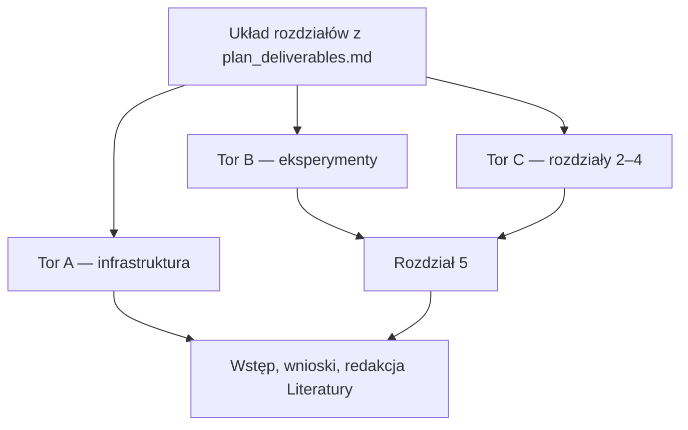

# Kolejność pracy

Ten dokument mówi **w jakiej kolejności** robić zadania. *Co* ma powstać, jest tylko w [`plan_deliverables.md`](plan_deliverables.md) — w tym układ rozdziałów, lista rysunków i reguły Zotero.

Stare pliki `artifacts/study_plan.md` i `artifacts/write_plan.md` nie wyznaczają już kolejności (miały dwa różne łańcuchy i dwa układy rozdziałów).

---

## Zasada

Po przyjęciu układu z źródła prawdy idą **trzy tory równoległe**. Schodzą się dwa razy: przy rozdziale 5 (potrzebne figury) i przy wstępie/wnioskach (potrzebna treść i wyniki).

Zotero **zaczyna się od razu**, ale komplet Literatury jest na końcu. `docs/theory_notes.md` wystarcza jako ściąga do rozdziałów 3–4; nie czeka się na osobne kompendium.

---

## Twarda kolejność (zależności)

Zrób najpierw lewą kolumnę, zanim ruszysz prawą. Reszta nie jest bramką.

| Najpierw | Potem | Powód |
| :--- | :--- | :--- |
| Układ z [`plan_deliverables.md`](plan_deliverables.md) | puste `thesis/tex/20_pbr.tex` … `50_…tex` i `\include` w `main.tex` | inaczej powstaje zły szkielet |
| Stałe klucze w Zotero (choćby rdzeń: Braun, 802.11, Schmidl–Cox) | `\cite{...}` w tekście | nie trzeba pełnej bazy, trzeba niezmiennych kluczy |
| Oba skrypty w `scripts/` + zapis do `thesis/img/` | rozdział 5 | komentarz idzie pod konkretne rysunki |
| Szkice rozdz. 2–5 (albo jasna teza + faktyczne wyniki) | wstęp i wnioski | inaczej wstęp zmyśla cele, wnioski zmyślają odkrycia |

**Nie** jest zależnością:

- dokończenie Zotero przed szkieletem LaTeX
- `theory_deep_dive.md` przed pisaniem `.tex`
- rozdział 2 przed rozdziałem 3
- skrypt porównawczy przed skryptem krzywych SNR
- eksport do `thesis/img/` dopiero po napisaniu całej teorii

---

## Tor A — infrastruktura (od razu, w tle)

Można przeplatać z kodem i z tekstem.

1. Kolekcja Zotero *Wi-Fi Radar*, Better BibTeX, automatyczny eksport do `thesis/bibliography.bib`.
2. Import PDF-ów z `references/`; przy każdym rekordzie DOI albo URL. Inwentarz tabelaryczny w `docs/references.md`.
3. Dane ze zgłoszenia w `thesis/main.tex` i stronie tytułowej; zmiana etykiety na pracę inżynierską; program pracy w `03_MasterThesisOutline.tex`.
4. Szkielet plików rozdziałów według tabeli w źródle prawdy; usunięcie / zastąpienie `20_first_chapter_RENAME_ME.tex`.

Tor A nie blokuje toru B ani szkicowania rozdziałów 2–4. Blokuje tylko cytowania bez kluczy i skład całej pracy bez `\include`.

---

## Tor B — eksperymenty (wcześnie, bo żywi rozdział 5)

Istniejące `src/` zostawiamy. Dwa skrypty są niezależne od siebie; oba powinny pisać też do `thesis/img/`.

1. `scripts/generate_szwej_comparison_plots.m` — CIR vs CAF, 3D/2D/1D, MTI, CLEAN.
2. `scripts/evaluate_snr_curves.m` — $SNR_{\mathrm{out}}$ vs $SNR_{\mathrm{in}}$.
3. Upewnić się, że `clean_interpreter.m` (i w razie potrzeby `receiver_correlation.m`) zapisują figury w tym samym katalogu składu, bez ręcznego kopiowania.
4. Sprawdzenie, że `scripts/run_full_simulation.m` nadal składa łańcuch bazowy do `results/figures/`.

Dopóki nie ma zestawu z §4 źródła prawdy, nie warto pisać rozdziału 5 „w ciemno”. Czytać Szwej/Sorbiana pod kątem *jakie* osie i porównania pokazać — tak, równolegle z kodem.

---

## Tor C — proza teoretyczna (równolegle z A i B)

Źródła: [`theory_notes.md`](theory_notes.md), Braun, 802.11, kod w `src/`, układ z źródła prawdy. Pisać od razu do `.tex`, nie przez drugi Markdown.

| Rozdział | Zależności | Równoległość |
| :--- | :--- | :--- |
| 2 PBR | prawie żadne (koncepcja + CAF vs CIR) | można zacząć natychmiast |
| 3 PHY 802.11 | notatki + standard; nie czeka na wykresy | niezależny od rozdz. 2 |
| 4 algorytmy | notatki + `receiver_pipeline.m` / `clean_interpreter.m` | po szkicu 3 wygodniej, ale nie twarda bramka |
| 5 wyniki | **tor B zakończony** (figury w `thesis/img/`) | po 2–4 albo w trakcie domykania 4 |
| 1 wstęp | świadomy cel + wiemy, co wyszło w 5 | na końcu |
| 6 wnioski | rozdz. 5 | na końcu |

Rozdział 4 cytuje wzory, które już są w kodzie. Nie czeka na nowe skrypty. Rozdział 5 czeka.

---

## Sugerowany przebieg (gdy ktoś chce jedną ścieżkę)

To jest kolejność *czytania listy zadań*, nie zakaz równoległości. Nawiasem: co można odpalić w tym samym czasie.

1. **Dzień 0** — potwierdzić układ z [`plan_deliverables.md`](plan_deliverables.md); nie wracać do mapy z `artifacts/`.
2. **Szkielet + Zotero rdzeń** (tor A) *i jednocześnie* start obu skryptów (tor B).
3. **Rozdziały 2 i 3** (tor C), gdy figury jeszcze się liczą.
4. **Rozdział 4**, gdy 3 ma siatkę podnośnych i preambułę; w tle domknąć DOI w Zotero.
5. **Rozdział 5** — dopiero gdy katalog rysunków z źródła prawdy leży w `thesis/img/`.
6. **Wstęp, wnioski, program pracy, Literatura** — na końcu; Zotero tu się *domyka*, nie zaczyna.

Ramy czasowe ze starego planu (~1–2 dni skrypty, ~3–5 dni teoria, ~2–3 dni wyniki, ~1–2 dni redakcja) nadal są rozsądne przy pracy skupionej. Nie są kamieniami milowymi: tor B można rozciągnąć, byle rozdział 5 nie wyprzedził figur.

---

## Weryfikacja na końcu

1. Wzory w rozdz. 3–4 = [`theory_notes.md`](theory_notes.md) = zachowanie `src/`.
2. Każde `\cite` ma rekord w Zotero i w eksporcie `.bib`; `docs/references.md` ma ten sam klucz; `pdflatex` + BibTeX składa Literaturę.
3. Każdy rysunek z katalogu w źródle prawdy jest w `thesis/img/` i ma podpis w rozdz. 5.
4. `run_full_simulation` plus dwa skrypty badawcze kończą się bez błędu.
