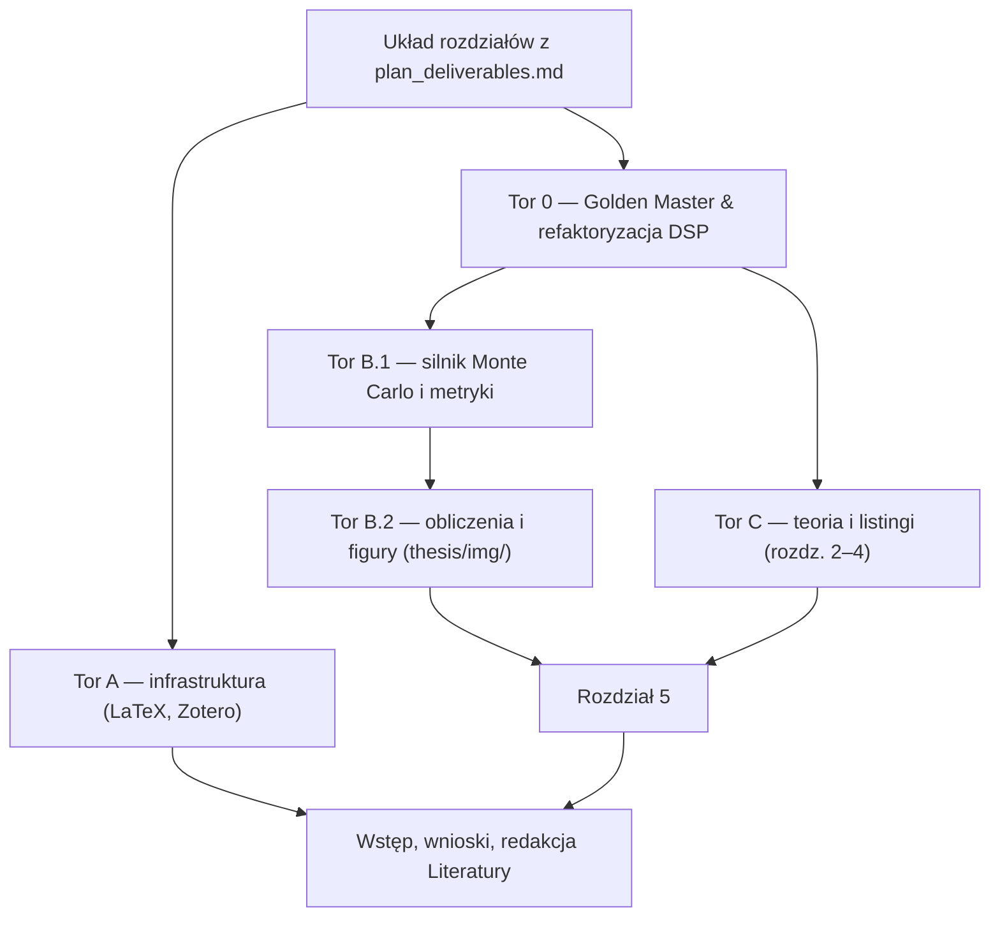

# Kolejność pracy

Ten dokument mówi **w jakiej kolejności** robić zadania. *Co* ma powstać, jest tylko w [`plan_deliverables.md`](plan_deliverables.md) — w tym układ rozdziałów, lista rysunków i reguły Zotero.

## Status realizacji prac (Dashboard)

| Tor / Etap | Zakres | Status |
| :--- | :--- | :--- |
| **Tor 0** | Golden Master & refaktoryzacja DSP do `lib/` | `[DO ZROBIENIA]` |
| **Tor A** | Infrastruktura (Zotero, dane formalne, szkielet `.tex`) | `[W TRAKCIE]` (szkielet `.tex` gotowy) |
| **Tor B.1** | Silnik Monte Carlo & estymator $SNR_{\mathrm{out}}$ | `[DO ZROBIENIA]` |
| **Tor B.2** | Obliczenia i katalog 8 figur do `thesis/img/` | `[DO ZROBIENIA]` |
| **Tor C** | Rozdziały 2–4 w LaTeX (z listingami) | `[DO ZROBIENIA]` |
| **Rozdział 5** | Badania symulacyjne i interpretacja | `[DO ZROBIENIA]` |
| **Domknięcie** | Wstęp, wnioski, program pracy, bibliografia | `[DO ZROBIENIA]` |

---

## Zasada

Po przyjęciu układu z źródła prawdy pracujemy według ścieżki sterowanej zależnościami:
1. **Tor 0 (Krok zerowy)**: Zabezpieczenie kodu wzorcem Golden Master, lekka refaktoryzacja DSP do czystych funkcji w `lib/` oraz wygenerowanie listingów do pracy.
2. **Trzy tory równoległe**:
   - **Tor A (Infrastruktura)**: Zotero, dane formalne, szkielet rozdziałów LaTeX.
   - **Tor B (Eksperymenty)**: Dwa skrypty badawcze bazujące bezpośrednio na szybkich funkcjach w pamięci z `lib/`.
   - **Tor C (Teoria i algorytmy)**: Rozdziały 2–4 korzystające z gotowych listingów i ujednoliconej notacji.
3. **Faza domknięcia**: Rozdział 5 (po wygenerowaniu figur z Toru B), a następnie Wstęp, Wnioski i domknięcie Literatury.

```mermaid
flowchart TD
    D["Układ rozdziałów z plan_deliverables.md"]
    R0["Tor 0 — Golden Master & refaktoryzacja DSP"]
    A["Tor A — infrastruktura (LaTeX, Zotero)"]
    B1["Tor B.1 — silnik Monte Carlo i metryki"]
    B2["Tor B.2 — obliczenia i figury (thesis/img/)"]
    C["Tor C — teoria i listingi (rozdz. 2–4)"]
    R5["Rozdział 5"]
    END["Wstęp, wnioski, redakcja Literatury"]

    D --> R0
    D --> A
    R0 --> B1
    B1 --> B2
    R0 --> C
    A --> END
    B2 --> R5
    C --> R5
    R5 --> END
```

---

## Twarda kolejność (zależności)

Zrób najpierw lewą kolumnę, zanim ruszysz prawą. Reszta nie jest bramką.

| Najpierw | Potem | Powód |
| :--- | :--- | :--- |
| Układ z [`plan_deliverables.md`](plan_deliverables.md) | puste `thesis/tex/20_pbr.tex` … `50_…tex` i `\include` w `main.tex` | inaczej powstaje zły szkielet |
| Wzorzec Golden Master + test regresyjny (`tests/`) | wydzielenie funkcji DSP do `lib/` | gwarancja braku rozjechania się wyników numerycznych |
| Czyste funkcje DSP w `lib/` + listingi w `thesis/listings/` | silnik Monte Carlo (B.1) i rozdział 4 (Tor C) | pętle Monte Carlo w RAM; spójne nazwy zmiennych i wzorów w tekście |
| Implementacja harnessu Monte Carlo i estymatora $SNR_{\mathrm{out}}$ (B.1) | wygenerowanie figur i krzywych (B.2) do `thesis/img/` | nie można wykreślić wyników przed implementacją silnika statystycznego |
| Stałe klucze w Zotero (choćby rdzeń: Braun, 802.11, Schmidl–Cox) | `\cite{...}` w tekście | nie trzeba pełnej bazy, trzeba niezmiennych kluczy |
| Obliczenia B.2 + zapis do `thesis/img/` | rozdział 5 | komentarz idzie pod konkretne rysunki |
| Szkice rozdz. 2–5 (albo jasna teza + faktyczne wyniki) | wstęp i wnioski | inaczej wstęp zmyśla cele, wnioski zmyślają odkrycia |

---

## Tor 0 — Bezpieczna refaktoryzacja i wzorzec Golden Master (krok wyjściowy)

Wykonywany przed pisaniem skryptów badawczych i rozdziału 4, aby dostarczyć czyste klocki DSP i listingi.

- [ ] 1. **Utrwalenie wzorca odniesienia („Golden Master”)**: uruchomienie pełnego łańcucha ze stałym ziarnem (`rng(42, 'twister')`) i zapis referencyjnych macierzy (`golden_*.mat`).
- [ ] 2. **Automatyczny test regresyjny**: skrypt `tests/verify_regression.m` porównujący wyniki nowego kodu z wzorcem z tolerancją `1e-12`.
- [ ] 3. **Ekstrakcja czystych funkcji DSP do `lib/`**: `lib/estimate_channel_zf.m` (ZF, maskowanie, MTI, DC), `lib/compute_range_doppler_map.m` (okno 2D Blackman–Harris, periodogram 2D), `lib/run_coherent_clean.m` (pętla Coherent CLEAN).
- [ ] 4. **Skrypty w `src/` jako fasady (pełna kompatybilność)**: wywołują funkcje z `lib/`, zapisują te same pliki `.mat`; `run_full_simulation.m` działa bez modyfikacji.
- [ ] 5. **Pakiet listingów i styl `minted`**: wygenerowanie 4 zwartych plików kodu do `thesis/listings/` (rozdz. 4.2, 4.3–4.4, 4.5–4.6, 4.7) ze zmiennymi zbieżnymi z notacją pracy ($Y, X, H, \mathbf{W}_{\mathrm{2D}}$); konfiguracja `\setminted[matlab]{...}` w `thesis/tex/00_preambule.tex`.

---

## Tor A — infrastruktura (od razu, w tle)

Można przeplatać z kodem i z tekstem.

- [x] 1. Szkielet plików rozdziałów według tabeli w źródle prawdy (`10_introduction.tex` … `99_conclusion.tex` w `thesis/tex/`).
- [ ] 2. Kolekcja Zotero *Wi-Fi Radar*, Better BibTeX, automatyczny eksport do `thesis/bibliography.bib`.
- [ ] 3. Import materiałów z `references/` do Zotero, uzupełnienie metadanych/DOI i bezpośredni eksport do `.bib` (bez ręcznego inwentarza w Markdownie).
- [ ] 4. Dane ze zgłoszenia w `thesis/main.tex` i stronie tytułowej; zmiana etykiety na pracę inżynierską; program pracy w `03_MasterThesisOutline.tex`.

Tor A nie blokuje toru B ani szkicowania rozdziałów 2–4. Blokuje tylko cytowania bez kluczy i skład całej pracy bez `\include`.

---

## Tor B — eksperymenty (wcześnie, bo żywi rozdział 5)

Dzięki Torowi 0 algorytmy DSP są już przetestowanymi, czystymi funkcjami w `lib/`. Tor B realizuje dwuetapowy proces: najpierw implementację silnika symulacyjnego i pętli Monte Carlo, a dopiero potem generowanie i eksport finalnych figur.

### B.1. Implementacja harnessu badawczego i metryk Monte Carlo (przed wykreślaniem)
- [ ] 1. **Definicja i estymator $SNR_{\mathrm{out}}$**: analityczny pomiar stosunku mocy komórki wykrytego celu (pik na mapie Range–Doppler) do średniej wariancji tła szumowego w obszarze wolnym od ech i przesłuchu bezpośredniego.
- [ ] 2. **Pętla uśredniania statystycznego Monte Carlo**: generator $N$ niezależnych realizacji ramki (losowe ciągi bitów payloadu i niezależne realizacje szumu AWGN dla każdego kroku $SNR_{\mathrm{in}}$) działający w pamięci RAM.
- [ ] 3. **Parametryzacja zmiennych eksperymentu**: modulacje MCS (np. BPSK 1/2 vs 16-QAM / 64-QAM), długość ładunku PSDU (krótka ramka vs maksymalna 4095 B), poziomy tłumienia echa celu względem przesłuchu bezpośredniego.

### B.2. Przeprowadzenie symulacji i eksport katalogu figur do `thesis/img/`
- [ ] 1. `scripts/generate_szwej_comparison_plots.m` — generacja scen porównawczych CIR vs CAF: mapy 3D (mesh), 2D (`imagesc`), przekroje 1D w osiach odległości i prędkości, stan przed i po MTI oraz przed i po CLEAN.
- [ ] 2. `scripts/evaluate_snr_curves.m` — wyliczenie i wykreślenie uśrednionych statystycznie krzywych $SNR_{\mathrm{out}} = f(SNR_{\mathrm{in}})$ dla metody CIR oraz CAF.
- [ ] 3. **Eksport do składu**: zapis 8 figur z katalogu §4 źródła prawdy bezpośrednio do `thesis/img/` (oraz roboczo do `results/figures/`) w stabilnych nazwach gotowych do `\includegraphics`.
- [ ] 4. Sprawdzenie, czy `scripts/run_full_simulation.m` nadal bezbłędnie składa pojedynczy łańcuch bazowy.

Dopóki nie ma zestawu figur z §4 źródła prawdy, nie warto pisać rozdziału 5 „w ciemno”.

---

## Tor C — proza teoretyczna (równolegle z A i B)

Źródła: [`theory_notes.md`](theory_notes.md), Braun, 802.11, listingi z `thesis/listings/`, układ z źródła prawdy. Pisać od razu do `.tex`, nie przez drugi Markdown.

| Rozdział | Zależności | Równoległość |
| :--- | :--- | :--- |
| 2 PBR | prawie żadne (koncepcja + CAF vs CIR) | można zacząć natychmiast |
| 3 PHY 802.11 | notatki + standard; nie czeka na wykresy | niezależny od rozdz. 2 (w tym analiza pakietowości, limitu PSDU i potencjału Multi-Frame CPI) |
| 4 algorytmy | Tor 0 (listingi z `thesis/listings/` i notacja wzorów) | po szkicu 3 wygodniej, ale nie twarda bramka |
| 5 wyniki | **Tor B.2 zakończony** (figury w `thesis/img/`) | po 2–4 albo w trakcie domykania 4 (wykresy uśredniane statystycznie Monte Carlo) |
| 1 wstęp | świadomy cel + wiemy, co wyszło w 5 | na końcu |
| 6 wnioski | rozdz. 5 | na końcu (podsumowanie ograniczeń i perspektywy: Multi-Frame CPI oraz SDR/CSI) |

Rozdział 4 bezpośrednio włącza listingi z `thesis/listings/` przez `\inputminted`. Nie czeka na skrypty badawcze Toru B. Rozdział 5 czeka.

Postęp pisania rozdziałów:
- [ ] Rozdział 2: Koncepcja bistatycznego radaru pasywnego (`thesis/tex/20_pbr.tex`)
- [ ] Rozdział 3: Sygnał Wi-Fi IEEE 802.11 (`thesis/tex/30_wifi_phy.tex`)
- [ ] Rozdział 4: Algorytmy przetwarzania radarowego (`thesis/tex/40_radar_dsp.tex`)
- [ ] Rozdział 5: Badania symulacyjne (`thesis/tex/50_simulation_results.tex`)
- [ ] Rozdział 1: Wstęp (`thesis/tex/10_introduction.tex`)
- [ ] Rozdział 6: Wnioski (`thesis/tex/99_conclusion.tex`)

---

## Sugerowany przebieg

1. **Dzień 0**:
   - Potwierdzić układ z [`plan_deliverables.md`](plan_deliverables.md).
   - Wykonać **Tor 0**: zabezpieczenie Golden Master, refaktoryzacja do `lib/`, test regresyjny, wygenerowanie listingów.
   - Rozpocząć **Tor A** (szkielet rozdziałów LaTeX + rdzeń Zotero).
2. **Dni 1–2 (Równolegle Tor B.1 i Tor C)**:
   - **Tor B.1**: implementacja silnika badawczego (estymator $SNR_{\mathrm{out}}$, pętla Monte Carlo w RAM, warianty modulacji i długości ramki).
   - **Tor C**: pisanie rozdziałów 2, 3 i 4 (z wklejaniem gotowych listingów).
3. **Dzień 3 (Tor B.2 i Rozdział 5)**:
   - **Tor B.2**: wykonanie obliczeń symulacyjnych i wygenerowanie kompletu 8 figur do `thesis/img/`.
   - Zredagowanie rozdziału 5 pod kątem uzyskanych wykresów.
4. **Dzień 4**:
   - Wstęp (rozdz. 1), wnioski (rozdz. 6), program pracy (`03_MasterThesisOutline.tex`), domknięcie bibliografii w Zotero.
   - Weryfikacja końcowa.

---

## Weryfikacja na końcu

- [ ] 1. Test regresyjny `tests/verify_regression.m` przechodzi bezbłędnie (maksymalny błąd $\le 10^{-12}$).
- [ ] 2. Wzory w rozdz. 3–4 = zachowanie `src/` i funkcji w `lib/`.
- [ ] 3. Każde `\cite` ma rekord w Zotero i w eksporcie `.bib`; `pdflatex` + BibTeX bezbłędnie składa Literaturę.
- [ ] 4. Każdy rysunek z katalogu w źródle prawdy jest w `thesis/img/` i ma podpis w rozdz. 5.
- [ ] 5. `run_full_simulation` plus dwa skrypty badawcze kończą się bez błędu.
